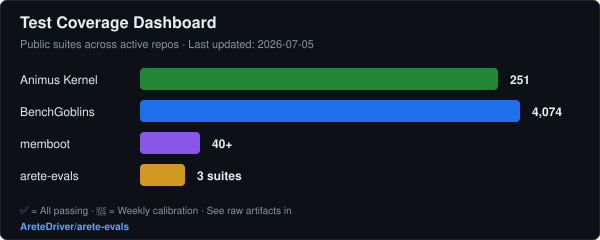

# James C. Young

**AI Enablement / Forward-Deployed Engineer** — Portland, OR

I ship LLM-powered products end to end — eval harnesses, multi-agent systems, billing, deploy — and I have the operations background to make them reliable. Before software I spent 17 years running manufacturing and logistics systems (IBM, Toyota Production System): standard work, visual management, error-proofing. A system that ships predictably beats one that demos brilliantly.

**[Portfolio](https://aretedriver.dev)** · **[LinkedIn](https://www.linkedin.com/in/james-y-3b77b3120)** · **[Substack](https://substack.com/@aretedriver)** · **[jamesyng79@gmail.com](mailto:jamesyng79@gmail.com)**

`Python` · `TypeScript` · `Rust` · `React / Next.js` · `FastAPI` · `PostgreSQL / SQLite` · `LLM evaluation & routing` · `multi-agent orchestration` · `MCP servers` · `Stripe` · `CI/CD (GitHub Actions)` · `Vercel / Fly.io` · `Azure`

**30+ active projects** · **15+ published PyPI packages** · **15,000+ tests across public packages** · **live Stripe billing**

---

## Now

What I'm building right now (Derek Sivers style):

- **[Animus](https://github.com/AreteDriver/animus) v2.1** — Public exocortex architecture (55K LOC, 172 files, bitemporal core, quality gates, checkpoint/resume). Linux-first open-source launch in progress.
- **Crucible** — Phase-gated transformation framework: four/five conditions, Qliphothic failure taxonomy, active/receptive polarity. Research layer under the Animus Mind-class scaffold.
- **Local AI Stack** — RX 7900 XTX powering zero-cost inference (Ollama, 4-model tiered stack). Eval calibration runs weekly against `arete-evals` suites.
- **TIAID consulting** — `$2,500 Rapid Assessment` + `$15K–$25K Full Engagement` products for trauma-informed AI deployment inside organizations.

---

## Start Here (AI Tooling)

If you only look at three repos, use this path:

1. **[ai-skills](https://github.com/Arete-Consortium/ai-skills)** — Production-ready skill system for Claude Code and multi-agent workflows
2. **[ai-session-templates](https://github.com/Arete-Consortium/ai-session-templates)** — Structured session templates for Claude Code, Codex, and repo-aware coding agents
3. **[memboot](https://github.com/AreteDriver/memboot)** — Zero-infrastructure persistent memory layer for any LLM

If one helps you, please star it. If something breaks, open a `setup-blocker` issue and I will prioritize it.

---

## Shipped Products

[**BenchGoblins**](https://benchgoblins.com) — AI fantasy-sports decision engine. Scored LLM routing under the hood, commissioner tools, live on Fly.io + Vercel with Stripe billing. *Production codebase private; comparable scored-routing patterns visible in [memboot](https://github.com/AreteDriver/memboot).*

[**EVE Gatekeeper**](https://edengk.com) — Route-intelligence platform for EVE Online: interactive 14-layer map, per-hop risk breakdown, gate-camp warnings. Stripe billing live. [GitHub](https://github.com/Arete-Consortium/Gatekeeper)

> **Past:** [anchormd](https://github.com/Arete-Consortium/anchormd) — AI-agent context-file generator and auditor (CLAUDE.md / AGENTS.md). Archived 2026; lessons absorbed into Animus document-control system and the `ai-session-templates` builder pipeline.

---

## Developer Tools — [PyPI](https://pypi.org/user/AreteDriver/)

| Tool | Description | Install |
|------|-------------|---------|
| [agent-lint](https://github.com/AreteDriver/agent-lint) | Workflow cost estimator and anti-pattern linter for agent YAML | `pip install agentlinter` |
| [context-hygiene](https://github.com/AreteDriver/context-hygiene) | Context-window bloat detection and signal-density scoring | `pip install context-hygiene` |
| [promptctl](https://github.com/AreteDriver/promptctl) | Claude API toolkit — prompt engineering, code review | `pip install promptctlai` |
| [ai-spend](https://github.com/AreteDriver/ai-spend) | AI API cost aggregator across providers | `pip install ai-spend` |
| [memboot](https://github.com/AreteDriver/memboot) | Zero-infra persistent memory for any LLM | `pip install memboot` |
| [convergentAI](https://github.com/AreteDriver/convergent) | Multi-agent coordination — intent graphs, consensus voting, stigmergy | `pip install convergentAI` |
| [mcp-manager](https://github.com/AreteDriver/mcp-manager) | Manage MCP servers across agentic IDEs | `pip install arete-mcp` |
| [arete-cc-plugin](https://github.com/AreteDriver/arete-cc-plugin) *(archived)* | Portable Claude Code plugin — hooks, slash commands, subagents | — |

---

## Open Source

[**Animus**](https://github.com/AreteDriver/animus) — Multi-agent orchestration framework: budget controls, quality gates, checkpoint/resume, autonomous self-improvement loop. ~17K LOC across core packages. *Previously private; now public and actively developed.*

[**Animus Mind**](https://github.com/AreteDriver/animus-mind) — v2.1 Mind-class architecture: bitemporal memory core, adversarial tests, deterministic quality scoring. The cognition layer behind the Animus exocortex.

[**Aurora Arcology**](https://aurora-arcology.vercel.app) — Investigation-board framework for narrative universes: an interactive corkboard of nodes, sourced claims, and confidence-weighted connections. Next.js 15 + TypeScript + SQLite/Drizzle, runtime-editable ontology. [GitHub](https://github.com/AreteDriver/aurora-arcology) · [Live demo](https://aurora-arcology.vercel.app)

[**chainlog**](https://github.com/AreteDriver/chainlog) — Tamper-proof audit trails for AI agents on Base L2 (Ethereum). Writes cryptographic fingerprints of actions on-chain — no PII, just hashes. Includes TypeScript + Python SDKs, CLI verifier, and a Next.js dashboard. Model version pinning for EU AI Act compliance, dead man's switch for contingency triggers.

[**stellar-audit-agent**](https://github.com/AreteDriver/stellar-audit-agent) — Pay-per-call AI code audit API with dual payment rails: x402 micropayments + Stripe MPP on Stellar. Autonomous Claude-powered agent discovers services, fetches repos, reasons about audit scope, pays per-request, and synthesizes results. Live demo on Fly.io. [Launch demo](https://stellar-audit-agent.fly.dev/)

[**RedOPS**](https://github.com/AreteDriver/RedOPS) — Professional cybersecurity intelligence & attack surface management platform. OSINT automation, MITRE ATT&CK threat-path mapping, risk quantification (likelihood × impact), and executive-ready reporting. Strict scope enforcement and audit trails for authorized defensive assessments.

[**azure-ops-mcp**](https://github.com/AreteDriver/azure-ops-mcp) — Azure Operations MCP Server — a resident SRE with persistent memory (ChromaDB), self-improving detection rules that learn from outcomes, and cost-aware operations. 13 tools for resource inventory, cost analysis, incident detection, and remediation. Semantic Kernel integration.

[**overwatch**](https://github.com/AreteDriver/overwatch) — Tactical ISR dashboard — unifies YOLO object detections, OSINT intel feeds, and drone telemetry into a single operational picture. Entity resolution, auto-briefing SITREP generation, geofencing, real-time WebSocket feed, and an 8-tab Streamlit dashboard.

[**arete-evals**](https://github.com/AreteDriver/arete-evals) — Public eval-suite records and run artifacts from the Animus Forge calibration pipeline. See the raw results that feed the quality gates.

**[Dossier](https://github.com/AreteDriver/Dossier)** — Local-first document intelligence: ingest PDFs/emails/scans, extract entities, surface relationships, forensics timeline. *Archived experiment — patterns extracted into Animus Mind v2.1.*

[**Argus Overview**](https://github.com/AreteDriver/Argus_Overview) — Linux multi-window manager for EVE Online. [PyPI](https://pypi.org/project/argus-overview/)

[**ai-skills**](https://github.com/Arete-Consortium/ai-skills) — Production-ready skills for Claude Code and multi-agent systems.

**EVE Frontier tooling** — [Monolith](https://github.com/Arete-Consortium/monolith): on-chain anomaly detector for EVE Frontier on Sui, with a live 3D-map demo of 24k systems.

---

## Benchmarks & Testing

I treat test coverage and eval calibration as first-class deliverables. Here's the public record:

| Project | Tests | Status | Eval Suite |
|---------|-------|--------|------------|
| **Animus Kernel** | 179 kernel + 72 head | ✅ All green | forge-personal-quality, forge-code-edit |
| **BenchGoblins** | 4,074 / 4,075 | ✅ 99.97% pass | provider-conformance, roster-integrity |
| **memboot** | 40+ (semantic security) | ✅ All green | SSRF-scoped, credential-denylist |
| **arete-evals** | 3 suites, 2 rubrics | 🔄 Weekly calibration | bootstrap A/B comparison |

**Latest calibration run:** `2026-07-02` — config_loader + rate_limiter test cases under repair; weekly schedule resumes after fixes. [View history →](https://github.com/AreteDriver/arete-evals)

---

## Selected Work

Direct entry points for "what does the code actually look like":

- **[memboot v0.7.1 — SSRF guard + credential-dir denylist](https://github.com/AreteDriver/memboot/commit/e4ba5c7)** — Semantic-security audit caught two MEDIUM findings the SAST run missed. Shipped scheme allowlist with redirect re-validation + extended default `ignore_patterns` to skip credential directories. Regression test asserts the exact attack scenarios stay out of `discover_files` output — poka-yoke against silent regression of the default skip list.

- **[Argus Overview — character-logoff detection](https://github.com/AreteDriver/Argus_Overview/commit/28e609e)** — Spec-driven feature in a 26K-download tool: tracker subscribes to existing `character_gone` signal, idempotent slot, 11 new tests including p95 latency under 5ms across 100 trials. Architecture luck — the detection signal already existed; the work was wiring + verifying.

- **[aurora-arcology — Dossier integration scoping](https://github.com/AreteDriver/aurora-arcology/blob/main/docs/dossier-bridge.md)** — Cross-project leverage analysis: four bridges from Dossier (forensic NER + briefing endpoint) into Aurora (narrative-investigation board), ranked by ROI with dependencies + effort estimates per bridge. The FDE pattern of recognizing where one product's primitives serve another's gap.

- **[Animus Mind — bitemporal core + adversarial tests](https://github.com/AreteDriver/animus-mind)** — v2.1 scaffold: bitemporal memory model with valid-time / transaction-time axes, adversarial test harness asserting quality-gate contracts before any feature ships.

---

## Consulting & Writing

**TIAID — Trauma-Informed AI Deployment** — a methodology for rolling out AI inside organizations without breaking the people, mapped to the NIST AI Risk Management Framework. Long-form essays on the human side of AI adoption at [The Human Stack](https://substack.com/@aretedriver).

---

## Background

I scaled an ice-cream production line from 740 pints/day to 4,800/hour using Kaizen — and I bring the same discipline to software: ship, measure, error-proof, repeat. *See it through. Do it better. Leave something real.*
